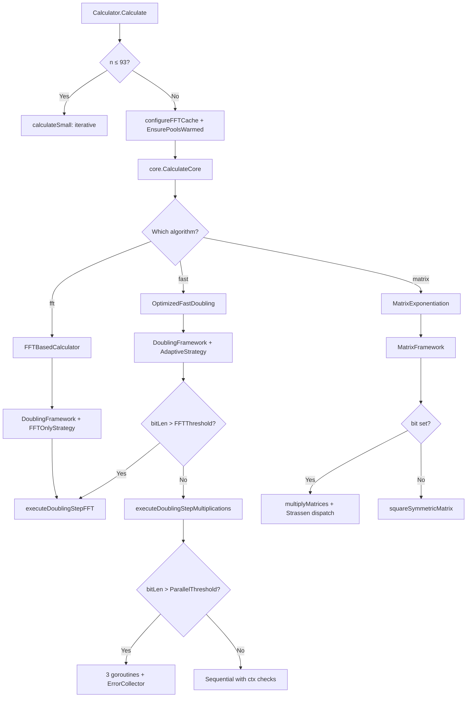

# Algorithm Execution Flows

This document traces the execution path for each Fibonacci algorithm implementation.

## Common Entry: FibCalculator Decorator

**File**: `internal/fibonacci/calculator.go:110-180`

All algorithms share the same entry path through the decorator:

```
FibCalculator.Calculate(ctx, progressChan, calcIndex, n, opts)
  1. NewProgressSubject()
  2. Register(NewChannelObserver(progressChan))
  3. CalculateWithObservers(ctx, subject, calcIndex, n, opts)
     a. Create reporter via subject.Freeze(calcIndex)    // lock-free observer snapshot
        OR no-op reporter if no observers
     b. n <= 93 → calculateSmall(n)                      // iterative addition, early return
     c. configureFFTCache(opts)                           // TransformCache settings
     d. bigfft.EnsurePoolsWarmed(n)                      // pre-warm sync.Pool
     e. core.CalculateCore(ctx, reporter, n, opts)       // dispatch to algorithm
     f. reporter(1.0)                                     // signal 100% completion
```

---

## Fast Doubling: `OptimizedFastDoubling`

**File**: `internal/fibonacci/fastdoubling.go:93`

```
CalculateCore(ctx, reporter, n, opts)
  1. s = AcquireState()                                   // from sync.Pool
     defer ReleaseState(s)
  2. Pre-size T1..T4 buffers if n > 10,000                // estimated bits ≈ n * 0.694
  3. normalizeOptions(opts)                                // fill 0-value thresholds
  4. useParallel = GOMAXPROCS > 1 && ParallelThreshold > 0
  5. strategy = &AdaptiveStrategy{}
  6. Create DoublingFramework:
     - if EnableDynamicThresholds: with DynamicThresholdManager
     - else: basic framework
  7. framework.ExecuteDoublingLoop(ctx, reporter, n, opts, s, useParallel)
```

### DoublingFramework.ExecuteDoublingLoop()

**File**: `internal/fibonacci/doubling_framework.go:167`

```
ExecuteDoublingLoop(ctx, reporter, n, opts, s, useParallel)
  numBits = bits.Len64(n)
  totalWork = CalcTotalWork(numBits)
  powers = PrecomputePowers4(numBits)                     // O(1) progress calc

  for i = numBits-1 down to 0:                           // MSB to LSB
    1. ctx.Err() check                                    // cancellation
    2. Record iterStart if dynamic thresholds enabled
    3. Buffer swap optimization: T1 ↔ T4 if cap(T1) > cap(T4)
    4. T4 = 2*FK1 - FK                                   // doubling prep
    5. Cache fkBitLen, fk1BitLen                          // avoid repeated BitLen()
    6. Determine FFT usage: fkBitLen > currentOpts.FFTThreshold
    7. Determine parallelization: shouldParallelizeMultiplicationCached()
       - If FFT range: only parallel if > ParallelFFTThreshold (5M bits)
       - Else: parallel if maxBitLen > ParallelThreshold
    8. strategy.ExecuteStep(ctx, s, currentOpts, shouldParallel)
       [see Strategy Dispatch below]
    9. T1 = T1 + T2                                       // F(2k+1) = F(k+1)² + F(k)²
    10. Pointer swap: FK, FK1, T2, T3, T1 = T3, T1, FK, FK1, T2
    11. Addition step if bit i of n is 1:
        T4 = FK + FK1
        FK, FK1, T4 = FK1, T4, FK
    12. Dynamic threshold: RecordIteration + ShouldAdjust
    13. ReportStepProgress(reporter, ...)

  result = s.FK                                           // zero-copy steal
  s.FK = new(big.Int)                                     // replace for pool return
  return result
```

### Strategy Dispatch: AdaptiveStrategy.ExecuteStep()

**File**: `internal/fibonacci/strategy.go`

```
AdaptiveStrategy.ExecuteStep(ctx, state, opts, inParallel)
  if opts.FFTThreshold > 0 && state.FK1.BitLen() > opts.FFTThreshold:
    → executeDoublingStepFFT(ctx, state, opts, inParallel)
      - Uses mulFFT/sqrFFT for all three operations
      - FFT transform reuse within the step
  else:
    → executeDoublingStepMultiplications(ctx, strategy, state, opts, inParallel)
      - Uses strategy.Multiply/Square (→ smartMultiply/smartSquare)
      - Three operations: T3=FK*T4, T1=FK1², T2=FK²
      - Parallel: 3 goroutines with ErrorCollector
      - Sequential: with ctx.Err() checks between operations
```

---

## Matrix Exponentiation: `MatrixExponentiation`

**File**: `internal/fibonacci/matrix.go:71`

```
CalculateCore(ctx, reporter, n, opts)
  1. state = acquireMatrixState()                          // from sync.Pool
     defer releaseMatrixState(state)
  2. framework = NewMatrixFramework()
  3. framework.ExecuteMatrixLoop(ctx, reporter, n, opts, state)
```

### MatrixFramework.ExecuteMatrixLoop()

**File**: `internal/fibonacci/matrix_framework.go:39`

```
ExecuteMatrixLoop(ctx, reporter, n, opts, state)
  if n == 0: return big.NewInt(0)
  exponent = n - 1
  numBits = bits.Len64(exponent)
  normalizeOptions(opts)
  useParallel = NumCPU > 1 && ParallelThreshold > 0

  for i = 0 to numBits-1:                                // LSB to MSB
    1. ctx.Err() check                                    // cancellation
    2. if bit i of exponent is 1:
       - inParallel = useParallel && maxBitLenMatrix(p) > ParallelThreshold
       - multiplyMatrices(tempMatrix, res, p, state, inParallel, FFTThreshold, StrassenThreshold)
         - Strassen dispatch if element bits > StrassenThreshold
         - Uses executeTasks[T,PT] generics for parallel/sequential
       - res, tempMatrix = tempMatrix, res               // pointer swap
    3. if i < numBits-1:
       - squareSymmetricMatrix(tempMatrix, p, state, inParallel, FFTThreshold)
         - Exploits symmetry: 4 multiplications instead of 8
       - p, tempMatrix = tempMatrix, p                   // pointer swap
    4. ReportStepProgress(reporter, ...)                  // inverted index for LSB→MSB

  result = state.res.a                                    // zero-copy steal
  state.res.a = new(big.Int)
  return result
```

---

## FFT-Based Doubling: `FFTBasedCalculator`

**File**: `internal/fibonacci/fft_based.go:47`

```
CalculateCore(ctx, reporter, n, opts)
  1. s = AcquireState()
     defer ReleaseState(s)
  2. strategy = &FFTOnlyStrategy{}                        // always FFT, no adaptive
  3. framework = NewDoublingFramework(strategy)
  4. framework.ExecuteDoublingLoop(ctx, reporter, n, opts, s, false)
     // false = no parallelization (FFT saturates CPU)
```

The `FFTOnlyStrategy` always routes through `executeDoublingStepFFT()`,
bypassing the bit-length check in `AdaptiveStrategy`.

---

## Multiplication Decision Tree

```
smartMultiply(z, x, y, opts) / smartSquare(z, x, opts)
  │
  ├── bitLen > opts.FFTThreshold?
  │   ├── Yes → mulFFT(z, x, y) / sqrFFT(z, x)      // bigfft package
  │   └── No  → z.Mul(x, y) / z.Mul(x, x)            // math/big (Karatsuba internally)
```

## Mermaid: Algorithm Selection


