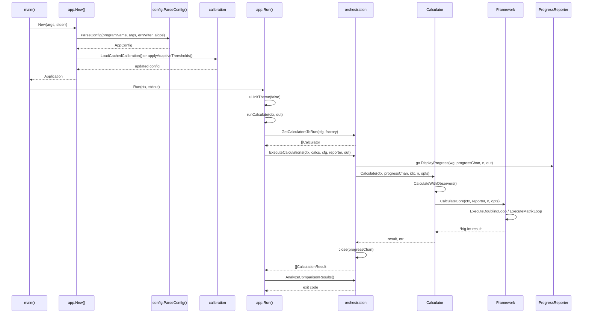

# CLI Execution Flow

This document traces the complete execution path for the standard CLI calculation mode.

## Entry Point

```
cmd/fibcalc/main.go:main()
  → run(os.Args, os.Stdout, os.Stderr)
    → app.HasVersionFlag(args[1:])       // early exit if --version
    → app.New(args, stderr)              // build Application
    → application.Run(ctx, stdout)       // dispatch and execute
```

## Application Construction: `app.New()`

**File**: `internal/app/app.go:47`

```
app.New(args, errWriter)
  1. fibonacci.GlobalFactory()                            // singleton with "fast", "matrix", "fft"
  2. factory.List()                                       // available algorithm names for validation
  3. config.ParseConfig(programName, cmdArgs, errWriter, availableAlgos)
     a. flag.NewFlagSet() — define all CLI flags
     b. fs.Parse(args) — parse command-line arguments
     c. applyEnvOverrides(&config, fs)                   // FIBCALC_* env vars for unset flags
     d. config.Validate(availableAlgos)                  // semantic validation
  4. calibration.LoadCachedCalibration(cfg, profilePath)  // try cached profile
     OR applyAdaptiveThresholds(cfg)                     // fallback: estimate from hardware
       a. EstimateOptimalParallelThreshold()             // CPU core count heuristic
       b. EstimateOptimalFFTThreshold()                  // 32-bit vs 64-bit heuristic
       c. EstimateOptimalStrassenThreshold()             // CPU core count heuristic
  5. return &Application{Config, Factory, ErrWriter}
```

## Application Dispatch: `app.Run()`

**File**: `internal/app/app.go:125`

```
app.Run(ctx, out)
  1. if Config.Completion != "" → runCompletion(out)      // shell completion scripts
  2. zerolog.SetGlobalLevel(InfoLevel)
  3. ui.InitTheme(false)                                  // terminal color support (NO_COLOR)
  4. if Config.Calibrate → runCalibration(ctx, out)       // full calibration mode
  5. runAutoCalibrationIfEnabled(ctx, out)                 // quick calibration if --auto-calibrate
  6. if Config.TUI → runTUI(ctx, out)                     // TUI dashboard mode
  7. runCalculate(ctx, out)                                // standard CLI mode
```

## CLI Calculation: `runCalculate()`

**File**: `internal/app/app.go:191`

```
runCalculate(ctx, out)
  1. context.WithTimeout(ctx, Config.Timeout)             // deadline
  2. signal.NotifyContext(ctx, SIGINT, SIGTERM)            // graceful shutdown
  3. orchestration.GetCalculatorsToRun(Config, Factory)
     - Config.Algo == "all": factory.List() → factory.Get() for each
     - specific algo: factory.Get(Config.Algo)
  4. cli.PrintExecutionConfig(Config, out)                 // unless quiet
  5. cli.PrintExecutionMode(calculators, out)              // unless quiet
  6. Choose ProgressReporter:
     - quiet: NullProgressReporter (drains channel silently)
     - normal: CLIProgressReporter (spinner + progress bar)
  7. orchestration.ExecuteCalculations(ctx, calculators, cfg, reporter, out)
     [see Orchestration Flow below]
  8. analyzeResultsWithOutput(results, outputCfg, out)
     a. findBestResult(results)                           // fastest successful result
     b. quiet mode: cli.DisplayQuietResult() + save file
     c. normal mode:
        - orchestration.AnalyzeComparisonResults(results, cfg, CLIResultPresenter{}, out)
          i.  sort results by duration (success first)
          ii. PresentComparisonTable() — formatted table
          iii. validate result consistency across algorithms
          iv. PresentResult() — final result display
        - saveResultIfNeeded() — write to file if --output
```

## Orchestration Flow

**File**: `internal/orchestration/orchestrator.go:56`

```
ExecuteCalculations(ctx, calculators, cfg, progressReporter, out)
  1. results = make([]CalculationResult, len(calculators))
  2. progressChan = make(chan ProgressUpdate, len(calculators) * 50)
  3. go progressReporter.DisplayProgress(&wg, progressChan, len(calculators), out)
  4. Build fibonacci.Options from cfg (Threshold, FFTThreshold, StrassenThreshold)
  5. Single calculator: direct call (no errgroup overhead)
     Multiple calculators: errgroup.WithContext(ctx)
     For each calculator:
       startTime → calculator.Calculate(ctx, progressChan, idx, cfg.N, opts) → CalculationResult
  6. close(progressChan)
  7. wg.Wait()                                            // wait for progress display to finish
  8. return results
```

## Calculator Flow

**File**: `internal/fibonacci/calculator.go:110`

```
FibCalculator.Calculate(ctx, progressChan, calcIndex, n, opts)
  1. NewProgressSubject()
  2. Register(NewChannelObserver(progressChan))
  3. CalculateWithObservers(ctx, subject, calcIndex, n, opts)
     a. subject.Freeze(calcIndex)                        // lock-free observer snapshot
     b. n <= 93: calculateSmall(n) — iterative addition
     c. configureFFTCache(opts)                          // set cache parameters
     d. bigfft.EnsurePoolsWarmed(n)                     // pre-warm memory pools
     e. core.CalculateCore(ctx, reporter, n, opts)      // delegate to algorithm
     f. reporter(1.0)                                    // signal completion
```

## Mermaid Sequence Diagram


