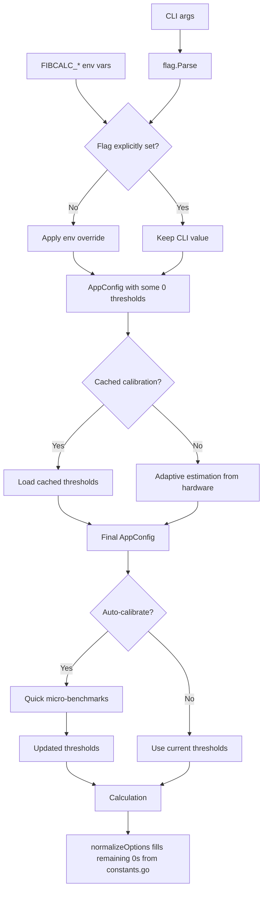

# Configuration Flow

This document traces the complete configuration resolution path from CLI flags
through environment variables to adaptive threshold estimation.

## Priority Order

```
CLI flags (highest)  >  Environment variables (FIBCALC_*)  >  Cached calibration profile  >  Adaptive hardware estimation  >  Static defaults (lowest)
```

## Configuration Parsing: `config.ParseConfig()`

**File**: `internal/config/config.go:129`

```
ParseConfig(programName, args, errorWriter, availableAlgos)
  1. flag.NewFlagSet(programName, ContinueOnError)
  2. Register all flags with defaults:
     - -n (uint64, default: 100_000_000)
     - -v/--verbose (bool, false)
     - -d/--details (bool, false)
     - --timeout (duration, 5m)
     - --algo (string, "all")
     - --threshold (int, 0 = auto)
     - --fft-threshold (int, 0 = auto)
     - --strassen-threshold (int, 0 = auto)
     - --calibrate (bool, false)
     - --auto-calibrate (bool, false)
     - --calibration-profile (string, "")
     - -o/--output (string, "")
     - -q/--quiet (bool, false)
     - --completion (string, "")
     - -c/--calculate (bool, false)
     - --tui (bool, false)
  3. setCustomUsage(fs)
  4. fs.Parse(args)
  5. applyEnvOverrides(&config, fs)     // only for flags NOT explicitly set
  6. strings.ToLower(config.Algo)
  7. config.Validate(availableAlgos)     // semantic validation
  8. return AppConfig, nil
```

## Environment Variable Overrides

**File**: `internal/config/env.go:115`

Only applied for flags that were NOT explicitly set on the command line.
Uses `isFlagSet(fs, name)` / `isFlagSetAny(fs, names...)` to check.

| Environment Variable | Config Field | Type |
|---------------------|-------------|------|
| `FIBCALC_N` | N | uint64 |
| `FIBCALC_ALGO` | Algo | string |
| `FIBCALC_TIMEOUT` | Timeout | duration |
| `FIBCALC_THRESHOLD` | Threshold | int |
| `FIBCALC_FFT_THRESHOLD` | FFTThreshold | int |
| `FIBCALC_STRASSEN_THRESHOLD` | StrassenThreshold | int |
| `FIBCALC_VERBOSE` | Verbose | bool |
| `FIBCALC_DETAILS` | Details | bool |
| `FIBCALC_QUIET` | Quiet | bool |
| `FIBCALC_CALIBRATE` | Calibrate | bool |
| `FIBCALC_AUTO_CALIBRATE` | AutoCalibrate | bool |
| `FIBCALC_CALCULATE` | ShowValue | bool |
| `FIBCALC_TUI` | TUI | bool |
| `FIBCALC_OUTPUT` | OutputFile | string |
| `FIBCALC_CALIBRATION_PROFILE` | CalibrationProfile | string |

Bool parsing accepts: `true`/`1`/`yes` and `false`/`0`/`no` (case-insensitive).

## Threshold Resolution in `app.New()`

**File**: `internal/app/app.go:64-78`

After `ParseConfig()`, thresholds with value `0` (auto) are resolved:

```
app.New()
  → calibration.LoadCachedCalibration(cfg, cfg.CalibrationProfile)
    - Loads ~/.fibcalc_calibration.json (or custom path)
    - If found: applies stored ParallelThreshold, FFTThreshold, StrassenThreshold
    - Only overrides fields that are still 0 (auto)

  → OR applyAdaptiveThresholds(cfg)  (fallback if no cached profile)
    - Threshold == 0 → calibration.EstimateOptimalParallelThreshold()
      - 1 CPU: 0 (disabled)
      - ≤2: 8192, ≤4: 4096, ≤8: 2048, ≤16: 1024, >16: 512
    - FFTThreshold == 0 → calibration.EstimateOptimalFFTThreshold()
      - 64-bit: 500,000 bits
      - 32-bit: 250,000 bits
    - StrassenThreshold == 0 → calibration.EstimateOptimalStrassenThreshold()
      - ≥4 CPUs: 256
      - <4 CPUs: 3072
```

## Runtime Threshold Normalization

**File**: `internal/fibonacci/options.go` (normalizeOptions)

When algorithms receive `Options`, zero values are filled from `constants.go` defaults:
- `ParallelThreshold == 0` → `DefaultParallelThreshold` (4096)
- `FFTThreshold == 0` → `DefaultFFTThreshold` (500,000)
- `StrassenThreshold == 0` → `DefaultStrassenThreshold` (3072)

## Auto-Calibration Flow

**File**: `internal/app/app.go:170`

When `--auto-calibrate` is set, a quick calibration runs before calculation:

```
app.Run()
  → runAutoCalibrationIfEnabled(ctx, out)
    → calibration.AutoCalibrate(ctx, Config, out, factory.GetAll())
      - Runs micro-benchmarks with reduced threshold sets
      - Updates Config with optimal values
      - Saves profile for future runs
```

## Mermaid Flow Diagram


