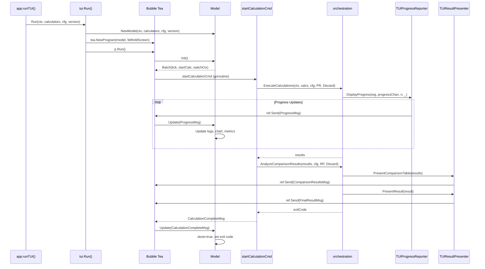

# TUI Execution Flow

This document traces the execution path for the interactive TUI dashboard mode,
activated via `--tui` flag or `FIBCALC_TUI=true`.

## Entry Point

The TUI shares the same `app.New()` path as CLI mode. Dispatch happens in `app.Run()`:

```
app.Run(ctx, out)
  → if Config.TUI → runTUI(ctx, out)
```

## TUI Launch: `runTUI()`

**File**: `internal/app/app.go:180`

```
runTUI(ctx, out)
  1. context.WithTimeout(ctx, Config.Timeout)
  2. signal.NotifyContext(ctx, SIGINT, SIGTERM)
  3. orchestration.GetCalculatorsToRun(Config, Factory)
  4. tui.Run(ctx, calculatorsToRun, Config, Version)
```

## TUI Initialization: `tui.Run()`

**File**: `internal/tui/model.go:303`

```
tui.Run(ctx, calculators, cfg, version)
  1. NewModel(ctx, calculators, cfg, version)
     - Create sub-models: HeaderModel, LogsModel, MetricsModel, ChartModel, FooterModel
     - Create context with cancel for calculation lifecycle
     - Create programRef{} (shared pointer that survives Bubble Tea model copies)
  2. tea.NewProgram(model, tea.WithAltScreen())
  3. model.ref.program = p                                // inject program reference
  4. p.Run()                                              // start Bubble Tea event loop
  5. Return exit code from final model
```

## Bubble Tea Lifecycle (Elm Architecture)

### Init()

**File**: `internal/tui/model.go:77`

```
Model.Init() → tea.Batch(
  tickCmd()                                               // 500ms periodic tick
  startCalculationCmd(ref, ctx, calculators, cfg, gen)   // launch calculation goroutine
  watchContextCmd(ctx, gen)                               // watch for context cancellation
)
```

### startCalculationCmd()

**File**: `internal/tui/model.go:324`

This is the key bridge between TUI and the orchestration layer. It runs
in a background goroutine and sends results as Bubble Tea messages:

```
startCalculationCmd(ref, ctx, calculators, cfg, gen)
  1. TUIProgressReporter{ref} + TUIResultPresenter{ref}
  2. orchestration.ExecuteCalculations(ctx, calculators, cfg, progressReporter, io.Discard)
     - Progress flows: progressChan → TUIProgressReporter.DisplayProgress()
       → ref.Send(ProgressMsg{}) → Bubble Tea event loop → Model.Update()
  3. orchestration.AnalyzeComparisonResults(results, cfg, presenter, io.Discard)
     - Results flow: presenter.PresentComparisonTable() → ref.Send(ComparisonResultsMsg{})
     - Final result: presenter.PresentResult() → ref.Send(FinalResultMsg{})
  4. return CalculationCompleteMsg{ExitCode, Generation}
```

### Update() Message Handling

**File**: `internal/tui/model.go:86`

| Message Type | Source | Handler |
|-------------|--------|---------|
| `tea.KeyMsg` | User input | `handleKey()` — quit, pause, reset, scroll |
| `tea.WindowSizeMsg` | Terminal resize | `layoutPanels()` — recalculate 60/40 split |
| `ProgressMsg` | `TUIProgressReporter` | Update logs, chart, metrics, indicators |
| `ProgressDoneMsg` | `TUIProgressReporter` | No-op (progress complete) |
| `ComparisonResultsMsg` | `TUIResultPresenter` | Add results to logs panel |
| `FinalResultMsg` | `TUIResultPresenter` | Add final result, compute indicators async |
| `IndicatorsMsg` | `computeIndicatorsCmd` | Update metrics with bits/s, digits/s |
| `ErrorMsg` | `TUIResultPresenter` | Display error, mark done |
| `TickMsg` | `tickCmd()` | Sample memory + system stats (every 500ms) |
| `MemStatsMsg` | `sampleMemStatsCmd` | Update runtime memory metrics |
| `SysStatsMsg` | `sampleSysStatsCmd` | Update CPU/MEM sparklines |
| `CalculationCompleteMsg` | `startCalculationCmd` | Mark done, set exit code |
| `ContextCancelledMsg` | `watchContextCmd` | Mark done, quit |

### View() Layout

**File**: `internal/tui/model.go:231`

```
┌─────────────────────────────────────────────────────────┐
│ Header (title, version, elapsed time)            1 line │
├──────────────────────────┬──────────────────────────────┤
│                          │ Metrics (memory, GC, speed)  │
│ Logs (scrollable)        │ ~7 lines                     │
│ 60% width                ├──────────────────────────────┤
│                          │ Chart (progress, ETA,        │
│                          │ CPU/MEM sparklines)          │
│                          │ 40% width                    │
├──────────────────────────┴──────────────────────────────┤
│ Footer (keyboard shortcuts, status)              1 line │
└─────────────────────────────────────────────────────────┘
```

### Reset Flow (R key)

```
handleKey(Reset)
  1. cancel() current context
  2. generation++
  3. Create new context with cancel
  4. Reset all sub-models (header, logs, chart, metrics, footer)
  5. tea.Batch(tickCmd, startCalculationCmd, watchContextCmd)
```

## TUI Bridge: Progress and Result Adapters

**File**: `internal/tui/bridge.go`

The TUI bridge adapts orchestration interfaces to Bubble Tea messages:

```
TUIProgressReporter.DisplayProgress(wg, progressChan, numCalcs, _)
  - Creates format.ProgressWithETA state tracker
  - For each update from progressChan:
    - Compute average progress and ETA
    - ref.Send(ProgressMsg{...})                          // thread-safe via tea.Program.Send()
  - ref.Send(ProgressDoneMsg{})

TUIResultPresenter.PresentComparisonTable(results, _)
  → ref.Send(ComparisonResultsMsg{Results})

TUIResultPresenter.PresentResult(result, n, verbose, details, showValue, _)
  → ref.Send(FinalResultMsg{...})

TUIResultPresenter.HandleError(err, duration, _)
  → ref.Send(ErrorMsg{Err, Duration})
```

## Mermaid Sequence Diagram


